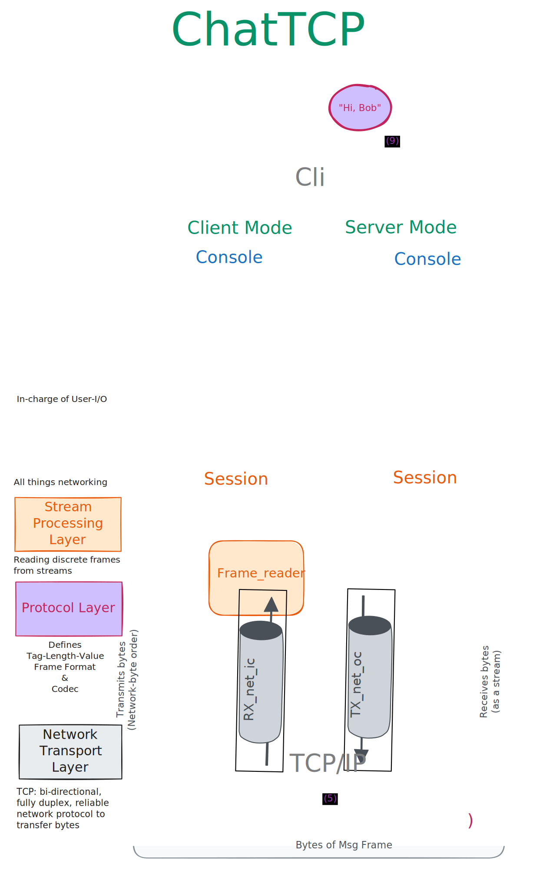

#+title: ChatTCP: A simple 1:1 Chat over TCP

*  Motivation

This is my implementation for a take-home assignment from Ahrefs Pte. Ltd. for their OCaml Developer position.

*  Quickstart

** Prerequisites

| what        | ver.                                          |
|-------------+-----------------------------------------------|
| OCaml, opam | 4.14+                                         |
| OS          | tried on MacOS / ArchLinux; ymmv for the rest |
|             |                                               |
** Steps

The most convient way is to use the Makefile targets:

1. Setup and Installation:

  #+caption: If it's a first time setup, (creates opam switch, installs deps)
  #+begin_src zsh
make setup && eval $(opam env)
  #+end_src

2. Build and install the executable (chat.exe)

   #+begin_src zsh
make build && make install
   #+end_src

3. Run the application (as server / client)
   #+caption: run as server, supply custom args
   #+begin_src zsh
chat server
# use chat server --help to see manpages
   #+end_src

   #+caption:separately, e.g. diff shell; run as client
   #+begin_src zsh
chat client
   #+end_src

4. Alternatively, run from the build directory without installing:
   #+begin_src zsh
# Terminal 1 (server)
make server -- -p 5050 --bind 127.0.0.1

# Terminal 2 (client)
make client -- --host 127.0.0.1 -p 5050
   #+end_src

5. Use =/help= within the terminal application if needed
   #+begin_src
> /help
   #+end_src
   -----

* Architecture: How a Message Travels via ChatTCP

The diagram below shows everything that happens when *Alice* (running as a client), types ="Hi, Bob"= and *Bob* (operating the server) sees it. The system is /seven layers deep/, *but* the message touches each one exactly once on the way down and once on the way back up.

*Nine steps*, *two peers*, *one TCP connection*.

Refer to the numbered arrows in the architecture diagram each step below maps to one arrow.

** The 7 Layers of Abstraction

The left side of the diagram names the *abstraction layers*. /Three are ours that we wrote/, two of them we borrow and use:

| Layer               | Module(s)             | Job (one sentence)                                                        |
|---------------------+-----------------------+---------------------------------------------------------------------------|
| CLI / UI            | =Cli=                   | Cmdliner = parses args, picks server or client mode, enters the app       |
| Supervisor          | =Server=, =Client=        | Owns lifecycle, resources, error policy ... the harness for everything    |
| User I/O Service    | =Console=               | Reads =stdin=, dispatches user events, displays output — app-lifetime     |
| Network I/O Service | =Session=, =Frame_reader= | Manages rx/tx loops, ack correlation, frame parsing — connection-lifetime |
| Protocol            | =Frame=                 | Defines TLV wire format, serialises/deserialises — pure, no I/O           |

Anything below that, /TCP handles reliable byte delivery/. Above that, the /terminal handles rendering/. We don't write code for either,  we just utilise them.

The critical boundary is between =Console= and =Session=. They meet through exactly two interfaces: =send_message= (where =Console= pushes *bytes* into session's =tx_queue=) and =on_rx= (session pushes received *events* back to console via callback).

Everything to the *top* of that boundary is *terminal I/O*. Everything *below* that boundary is *network I/O*.

** The Journey: Alice sends "Hi, Bob" to Bob

*** Steps 1–2: Keystroke $\implies$ bytes

Alice types /*"Hi, Bob"*/ into her terminal *(1)*. The string arrives at [[./lib/console.mli][=Console=]] through stdin as bytes *(2)*. =Console.parse_user_input= sees it's not a slash command, it's just a message,  so it wraps the line as =Send_msg (Bytes.of_string "Hi, Bob")=.

*** Step 3: Console $\implies$ Session handoff

=Console.maybe_send_msg= calls [[./lib/session.mli][=Session.send_message=]], which puts the payload (*bytes*) into an =Lwt_mvar= *(3)*  --- a *single-slot mailbox* that /blocks if the previous message hasn't been sent yet/. This is the *coordination point* between user I/O and network I/O.

Backpressure is built in because of this: if the network is slow, typing waits and Alice / Bob can feel their typing get slow on the terminal.

*** Step 4: Framing and transmission

On the other side of the *mvar*, =tx_loop= takes the payload, assigns a monotonic =msg_id=, and builds a =Frame.Msg= *(4)*. [[./lib/frame.mli][=Frame.to_bytes=]] serialises it into the [[https://en.wikipedia.org/wiki/Type%E2%80%93length%E2%80%93value][*TLV wire format*]]:

#+begin_example
[ type: 1B ][ msg_id: 4B ][ payload_length: 4B ][ payload: NB ]
[    0x00  ][   0x00..01 ][        0x00..07    ][ Hi, Bob     ]
#+end_example

Nine bytes of *header*, followed the *raw payload bytes* -- in network-byte-order (Big-endian). The =msg_id= gets recorded in a =pending_acks= table with a timestamp for /RTT calculation/.

The *serialised frame* is written to the TCP output channel and flushed.

*** Step 5: The wire

*TCP* carries the bytes to Bob's machine *(5)*. Packet segmentation, retransmission, reassembly and ordering ---  all of that reliably handled by the OS. The /protocol layer above doesn't think about any of that/.

*** Steps 6–7: Reassembly and dispatch

Bob's [[./lib/frame_reader.mli][=Frame_reader=]] reads exactly *9 header bytes* from the TCP input channel, parses them, validates the type tag and payload size (including a max-size guard before any allocation), then reads exactly =payload_length= bytes *(6)*. =Lwt_io= /handles partial TCP reads internally/ --- so =Frame_reader= has no accumulation logic, only  *exact-read calls*.

The resulting =Frame.Msg= enters =Session.rx_loop= *(7)*.

The session does two things:

  1. fires the =on_rx= callback with the message content, and

  2. auto-sends an =Ack= frame (echoing the =msg_id=) back to Alice. Ack generation is *automatic and immediate* --- the sender never waits.

*** Steps 8–9: Display

The =on_rx= callback pushes the *message content* to =Console=, which writes it to Bob's stdout via =Lwt_io.write_line= *(8)*. The terminal renders the bytes as /*"Hi, Bob"*/ *(9)*. Meanwhile, Alice's =rx_loop= receives the =Ack= frame, resolves the pending =msg_id= from the table, computes the round-trip time, and displays it on Alice's machine.

** What the Layers Give Us

1. Each layer *can be tested in isolation*.
   - =Frame= is pure --- tested with property-style codec tests and a torture corpus of payloads (null bytes, RTL scripts, emoji, raw =0xFF=).  [[./test/test_frame.ml][[ref]​]]

   - =Frame_reader= is tested via OS pipes simulating partial reads and abrupt disconnects. [[./test/test_frame_reader.ml][[ref]​]]

   - =Session= is tested with injected channels and callback accumulators. [[./test/test_session.ml][[ref]​]]

   - The [[./test/test_e2e.ml][e2e tests]] wire up real TCP over loopback and exercise the full path above.

2. The separation also *defines the error domains*.
   - =Frame= produces =Header_too_short | Unknown_frame_type | Payload_too_big=.

   - =Frame_reader= wraps those as =Protocol_error= and adds =Connection_lost=.

   - =Session= wraps both into =exit_reason= and adds =Broken_pipe=.

          Errors *compose upward; each layer adds meaning*. The harness catches the *final typed exit* and decides policy: log it, restart the session, or shut down.

For deeper discussion of the *design decisions* behind these layers, see [[./docs/progress_notes.org][=progress_notes.org=]]. For testing architecture, see [[./docs/testing_notes.org][=testing_notes.org=]].

-----

Here's a demo:

[[./docs/demo.webm]]

#+begin_quote
  ℹ /*Mirror Notice*/

  This repository is hosted on [[https://codeberg.org/rtshkmr/chat][Codeberg]], with a [[https://github.com/rtshkmr/chat][read-mirror]] on GitHub.

  (Interestingly, the demo video plays on Codeberg [in PIP mode] but not on GitHub.)

      ~ Ritesh
#+end_quote
